# Filters
Repo to store my filters  
As of January 14th 2025, Instagram stopped supporting 3rd party filters, as a result, the filters in this repo are no longer available for use.  
Due to the proprietary nature of the files, these filters may not even be convertible to other standards.  
I have captured the stats from Spark AR below.  

## Across All Filters  
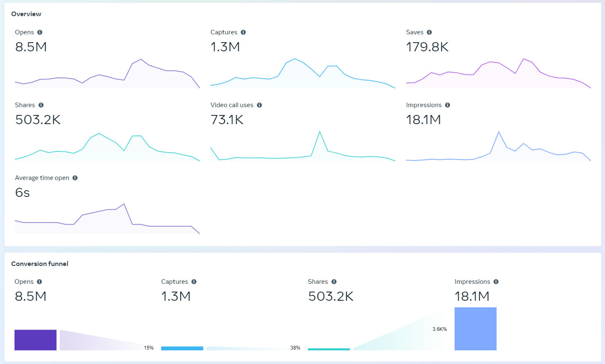  
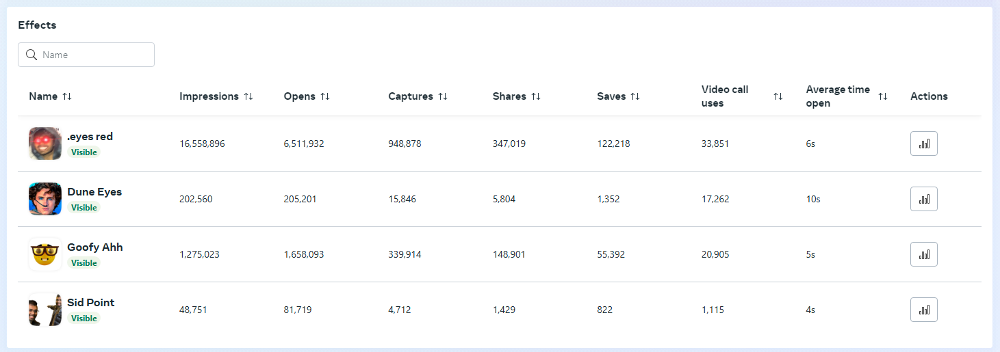  

## Eyes Red
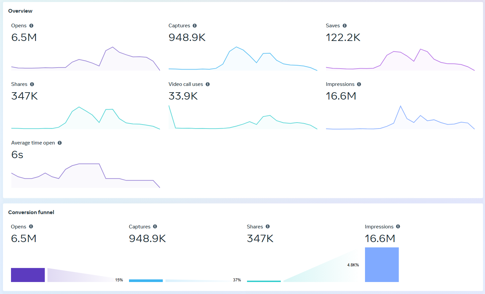  
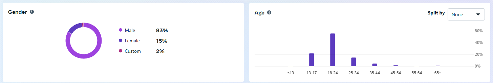  
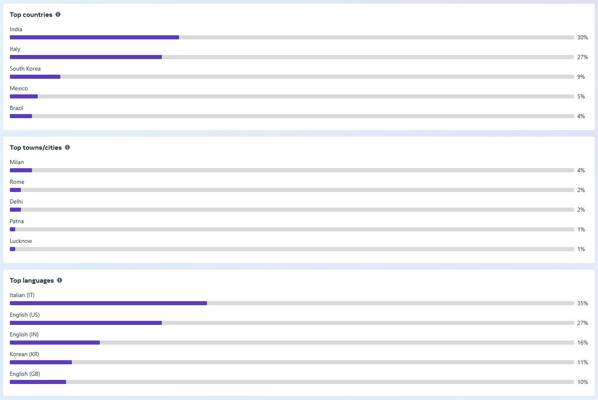  

## Dune Eyes  
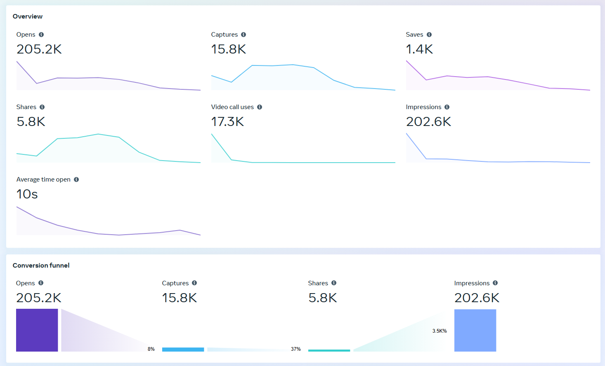  
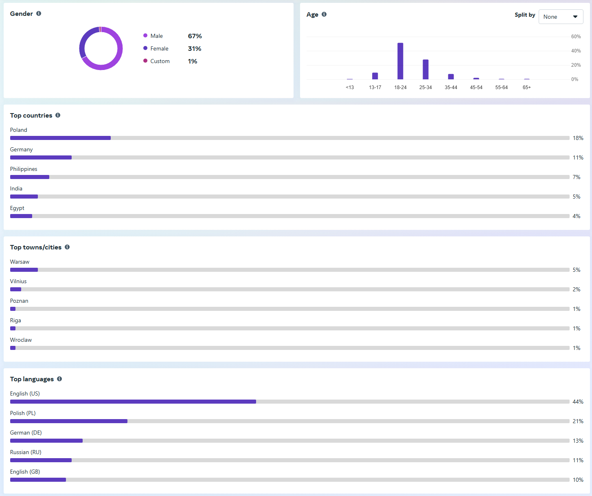  

# Goofy Ahh
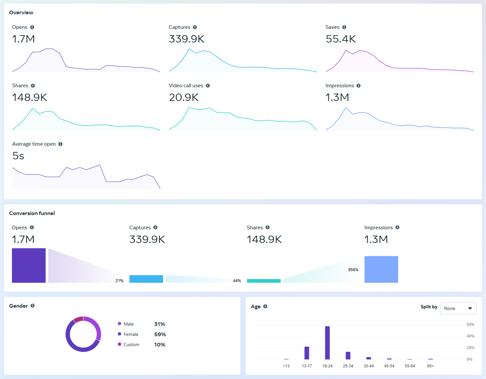  
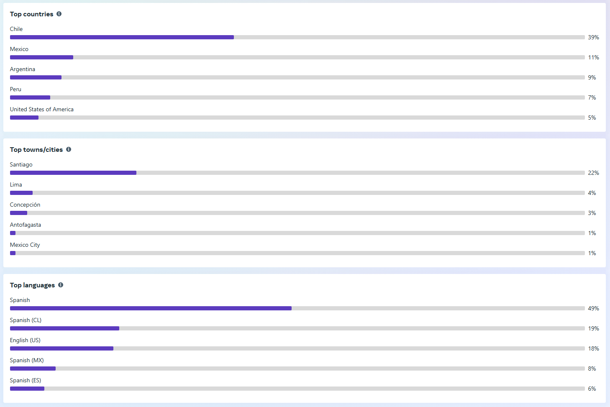  

# Sid Point
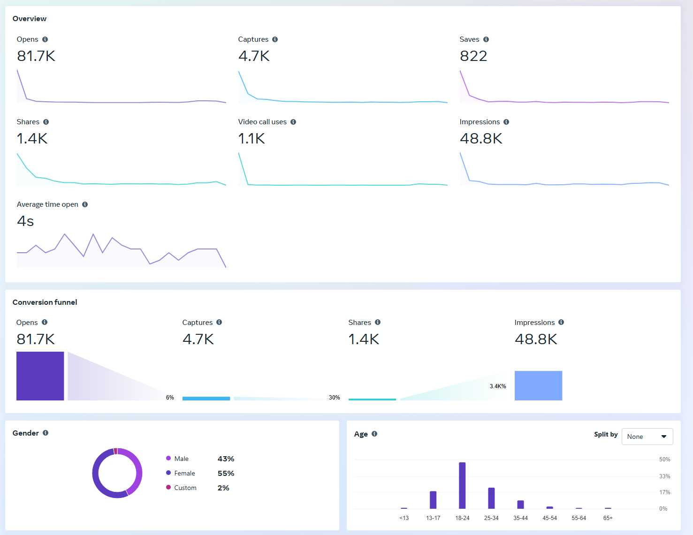  
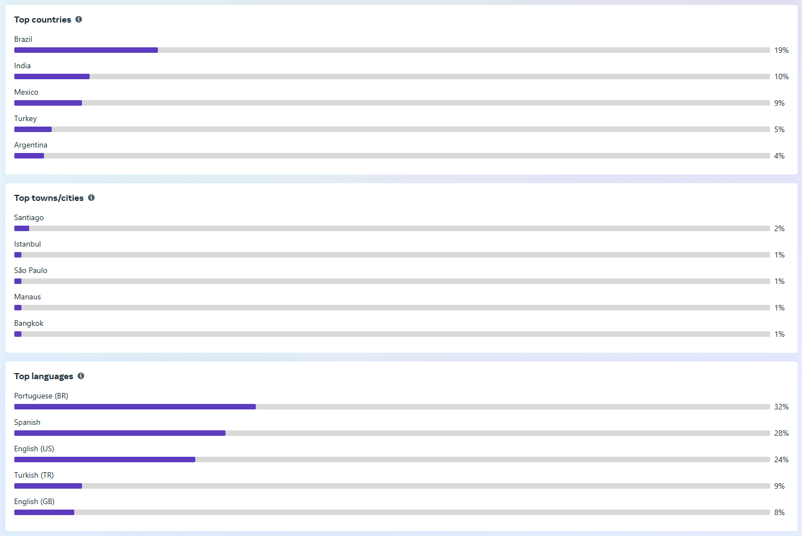  
